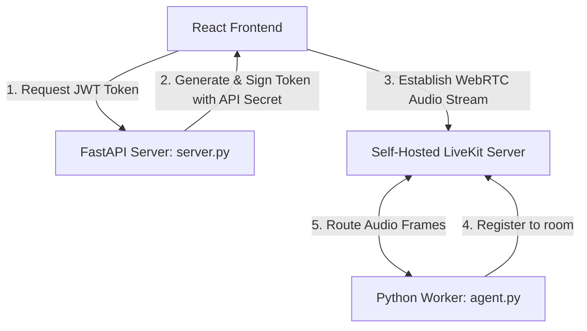

# 🎙️ Voice Agent: Complete Self-Hosted LiveKit Master Guide

An interactive, low-latency conversational AI voice assistant utilizing **LiveKit** (WebRTC), **FastAPI**, and **React**. 

By self-hosting LiveKit, you run the WebRTC media routing software on your own hardware or cloud server. **This bypasses the LiveKit Cloud platform entirely, meaning you pay zero usage charges, require no subscriptions, and have no credit limits.**

This master guide is split into two parts:
1. **Part 1: Local Development Setup** (Fast offline testing)
2. **Part 2: Production Self-Hosted Deployment** (Running your own free WebRTC cluster on a cloud VM)

---

## 🏛️ System Component Architecture

Whether running locally or in production, the system routes WebRTC packets through the self-hosted LiveKit Server:



---

## 💻 PART 1: Local Development Setup (100% Free & Offline)

Follow these steps to set up and run the system locally on your development machine.

### Step 1: Install LiveKit Server Locally
Choose the method matching your operating system:

* **Windows (via Scoop):**
  ```powershell
  scoop bucket add livekit https://github.com/livekit/scoop-bucket.git
  scoop install livekit-cli livekit-server
  ```
* **macOS (via Homebrew):**
  ```bash
  brew install livekit/tap/livekit-cli livekit/tap/livekit-server
  ```
* **Linux (Direct script):**
  ```bash
  curl -sSL https://get.livekit.io | bash
  ```
* **Docker (All OS):**
  If you have Docker installed, you can skip binary installations and run:
  ```bash
  docker run --rm -p 7880:7880 -p 7881:7881 -p 7882:7882/udp livekit/livekit-server --dev
  ```

---

### Step 2: Start the Server in Dev Mode
Run the following command in your terminal to start the server:
```bash
livekit-server --dev
```
When running in `--dev` mode:
- The server binds to `ws://localhost:7880`.
- The server automatically configures and trusts a static developer credential pair:
  - **API Key:** `devkey`
  - **API Secret:** `secret`

---

### Step 3: Configure environment variables (`.env`)
In the root directory of your project, update your `.env` file to use these local developer credentials:
```env
LIVEKIT_URL=ws://localhost:7880
LIVEKIT_API_KEY=devkey
LIVEKIT_API_SECRET=secret

# Cognitive APIs (Still required for AI logic)
OPENAI_API_KEY=your_openai_key
CARTESIA_API_KEY=your_cartesia_key
DEEPGRAM_API_KEY=your_deepgram_key
```

---

### Step 4: Start the Services
Open separate terminal windows and run:

1. **FastAPI Token Server:**
   ```bash
   # From root directory
   uvicorn server:app --reload --port 8000
   ```
2. **Voice Agent Worker:**
   ```bash
   # From root directory (ensure virtual environment is active)
   python agent.py dev
   ```
3. **React Frontend:**
   ```bash
   cd frontend
   npm install
   npm run dev
   ```
   Open `http://localhost:5173` in your browser.

---

## ☁️ PART 2: Production Self-Hosted Deployment (Docker & VPS)

To deploy your Voice Agent in production without paying LiveKit Cloud, you must deploy the LiveKit Server inside a containerized environment (e.g. AWS, GCP, DigitalOcean) and secure it with SSL/TLS.

### Phase A: Generating Your Own Free API Keys
LiveKit uses HMAC-SHA256 signature verification. You do not need to register anywhere to get keys. **You can invent any alphanumeric key-secret pairs you want.**
For example:
- **Your Custom Key:** `my_custom_production_key_123`
- **Your Custom Secret:** `my_custom_super_secure_secret_abc`

---

### Phase B: Create the LiveKit Server Configuration (`livekit.yaml`)
Create a file named `livekit.yaml` on your production server. This file configures your custom keys and defines the WebRTC port ranges:

```yaml
port: 7880
logging:
  level: info
rtc:
  port_range_start: 50000
  port_range_end: 60000
  use_external_ip: true
keys:
  # Map your custom API keys to secrets (you can add multiple keys here)
  my_custom_production_key_123: my_custom_super_secure_secret_abc
```

---

### Phase C: Deploy LiveKit Server in Docker
Deploy the container by mounting your `livekit.yaml` config and opening the control and media ports:

```bash
docker run -d \
  --name livekit-server \
  --restart unless-stopped \
  -p 7880:7880 \
  -p 50000-60000:50000-60000/udp \
  -v /path/to/livekit.yaml:/livekit.yaml \
  livekit/livekit-server \
  --config /livekit.yaml
```
- **Port 7880:** Handles WebSockets control and token verification.
- **Ports 50000-60000 (UDP):** Handles the raw WebRTC voice data packets directly.

---

### Phase D: Configure SSL/TLS (Required for Microphone Access)
Web browsers forcefully block microphone capture (`navigator.mediaDevices.getUserMedia`) on insecure `http://` URLs. **You must run your production frontend and token endpoints over HTTPS/WSS.**

#### Simple SSL Setup using Caddy (Automatic Let's Encrypt)
Deploy Caddy on your server as a reverse proxy. Create a `Caddyfile`:

```text
voice-agent.yourdomain.com {
    reverse_proxy localhost:7880
}
```
Caddy will automatically request, install, and renew Let's Encrypt SSL certificates. Your LiveKit Server is now securely accessible at `wss://voice-agent.yourdomain.com`.

---

### Phase E: Deploy Your Voice Agent & FastAPI Server
Configure your production environment variables to use your self-hosted server and custom keys:

```env
LIVEKIT_URL=wss://voice-agent.yourdomain.com
LIVEKIT_API_KEY=my_custom_production_key_123
LIVEKIT_API_SECRET=my_custom_super_secure_secret_abc
```

Build and run the Dockerfile provided in this repository to launch both the FastAPI token endpoint and the Python worker on your production VM:

```bash
# Build the production image
docker build -t voice-agent-production:latest .

# Run the container (exposing FastAPI on port 7860)
docker run -d \
  -p 7860:7860 \
  -e LIVEKIT_URL="wss://voice-agent.yourdomain.com" \
  -e LIVEKIT_API_KEY="my_custom_production_key_123" \
  -e LIVEKIT_API_SECRET="my_custom_super_secure_secret_abc" \
  -e OPENAI_API_KEY="your-openai-key" \
  -e CARTESIA_API_KEY="your-cartesia-key" \
  -e DEEPGRAM_API_KEY="your-deepgram-key" \
  --name voice-agent-running-instance \
  voice-agent-production:latest
```
Your FastAPI token endpoints will now be accessible at `https://voice-agent.yourdomain.com/getToken`. Configure your frontend build to query this secure URL, and you are live in production!
