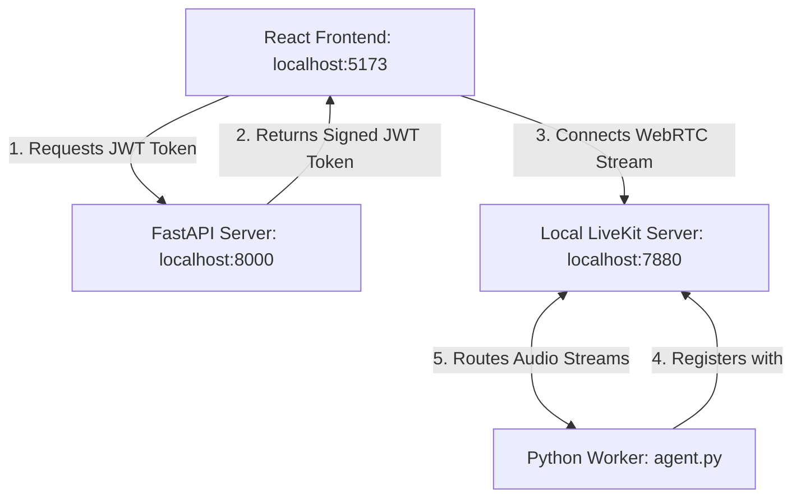

# Master Guide: Setup LiveKit Locally (100% Free & Offline)

This guide provides a comprehensive, step-by-step walkthrough to set up and run the entire **Voice Agent** pipeline locally on your computer. 

By running your own local instance of the **LiveKit Server**, you bypass the LiveKit Cloud platform completely. This means **you do not need a LiveKit account, nor will you consume a single API credit** for WebRTC audio routing.

---

## 📐 1. Local Architecture Overview

To understand how to run the system, you must understand how the components communicate. LiveKit uses a Hub-and-Spoke model where the **LiveKit Server** acts as the central router:



1. **FastAPI Server (`server.py`)** acts as the gatekeeper. It generates a cryptographic password (JWT Token) that authorizes the browser to enter a specific room.
2. **Local LiveKit Server (`livekit-server`)** handles the real-time audio WebRTC packets. It accepts connections from the browser and routes them to the agent.
3. **Voice Agent Worker (`agent.py`)** connects directly to the LiveKit server, listens for users joining, and runs the Speech-to-Text, LLM, and Text-to-Speech loops.

---

## 📥 2. Step 1: Install LiveKit Server on Your OS

You need to download the LiveKit Server binary so it can run directly on your operating system.

### A. Windows Installation
Choose **one** of the following methods to install on Windows:

#### Method 1: Using Scoop (Recommended)
Scoop is a command-line installer for Windows. If you have Scoop, open PowerShell and run:
```powershell
# Add the official LiveKit bucket repository
scoop bucket add livekit https://github.com/livekit/scoop-bucket.git

# Install the server and command-line utility
scoop install livekit-cli livekit-server
```

#### Method 2: Using Chocolatey
If you use Chocolatey, open an Administrator PowerShell and run:
```powershell
choco install livekit-server livekit-cli
```

#### Method 3: Manual Direct Download (No Package Manager)
If you don't use a package manager, you can download the raw executable:
1. Go to the [LiveKit Github Releases page](https://github.com/livekit/livekit/releases).
2. Find the latest release and download the file ending in `_windows_amd64.zip` (e.g., `livekit-server_X.Y.Z_windows_amd64.zip`).
3. Extract the ZIP file. You will get a file named `livekit-server.exe`.
4. Move `livekit-server.exe` to a folder on your computer (e.g., `C:\Program Files\LiveKit\`).
5. (Optional) Add this folder to your system environment `Path` so you can call `livekit-server` from any command prompt. If you don't add it to path, you must run commands inside the folder where `livekit-server.exe` was extracted.

---

### B. macOS Installation
Open your terminal and run via Homebrew:
```bash
brew install livekit/tap/livekit-cli livekit/tap/livekit-server
```

---

### C. Linux Installation
Run the official installation script in your terminal:
```bash
curl -sSL https://get.livekit.io | bash
```
This installs the `livekit-server` and `livekit-cli` binaries directly into `/usr/local/bin`.

---

### D. Using Docker (Cross-Platform Alternative)
If you already have Docker installed and running, you do not need to install any binaries. You can run the server directly using:
```bash
docker run --rm -p 7880:7880 -p 7881:7881 -p 7882:7882/udp livekit/livekit-server --dev
```

---

## ⚡ 3. Step 2: Start the Local LiveKit Server

To start your local LiveKit server, run it in **development mode** (`--dev`). Development mode configures the server with static keys, disables TLS/HTTPS requirements, and launches a local WebRTC endpoint.

Open your command prompt or terminal and run:
```bash
livekit-server --dev
```

When you run this command, you will see output in the console ending with something like:
```text
development mode active
API Key: devkey
API Secret: secret
routing loopback connections on port 7880
```

> [!IMPORTANT]
> **Keep this terminal window open!** If you close this window, the local LiveKit server will stop running, and the front-end / back-end won't be able to communicate.

---

## 🔑 4. Step 3: Understanding the API Keys

Because we started the server with the `--dev` flag, it generates a mock local authentication environment. You **do not** need to obtain key credentials from the LiveKit Cloud dashboard. 

The local server will accept and trust any WebRTC connection token that is signed using:
- **`LIVEKIT_API_KEY=devkey`**
- **`LIVEKIT_API_SECRET=secret`**

To configure the backend server (`server.py`) and agent (`agent.py`) to sign tokens and connect using these local developer credentials, open the **`.env`** file in the root directory of your project and verify/modify these lines:

```env
# ------------------------------------------------------------------------------
# LOCAL FREE LIVEKIT SETTINGS
# ------------------------------------------------------------------------------
# Points to your local LiveKit server running on port 7880
LIVEKIT_URL=ws://localhost:7880
# The developer key configured by the --dev flag
LIVEKIT_API_KEY=devkey
# The developer secret configured by the --dev flag
LIVEKIT_API_SECRET=secret

# ------------------------------------------------------------------------------
# THIRD-PARTY COGNITIVE SERVICES (STT / LLM / TTS) KEYS
# ------------------------------------------------------------------------------
# You still need these keys to run the AI features (transcription, brain, speech)
OPENAI_API_KEY=your_openai_key_here
CARTESIA_API_KEY=your_cartesia_key_here
DEEPGRAM_API_KEY=your_deepgram_key_here
SARVAM_API_KEY=your_sarvam_key_here
```

---

## 🚀 5. Step 4: Run the Backend Services

Now that the local LiveKit server is running, we need to boot up our Python services.

### A. Activate Your Virtual Environment
Open a **new** terminal window (do not close the `livekit-server` window) and navigate to the project directory:
```bash
cd "C:\Users\Ayush Kumar\Desktop\Workshop"
```
Activate the virtual environment:
- **Windows (Command Prompt):**
  ```cmd
  venv\Scripts\activate.bat
  ```
- **Windows (PowerShell):**
  ```powershell
  .\venv\Scripts\Activate.ps1
  ```
- **macOS / Linux:**
  ```bash
  source venv/bin/activate
  ```

### B. Start the FastAPI Token Server (`server.py`)
This server runs a REST API that creates and signs the authorization tokens.
```bash
uvicorn server:app --reload --port 8000
```
- The `--reload` flag tells Uvicorn to automatically reload the server whenever you edit backend code files.
- The server will be accessible at `http://localhost:8000`.

### C. Start the Voice Agent Worker (`agent.py`)
Open a **third** terminal window, navigate to the project, activate the virtual environment, and start the python agent process:
```bash
python agent.py dev
```
- The `dev` command loads the agent in hot-reload mode. It will connect to the local LiveKit server (`ws://localhost:7880`), listen for rooms, and wait for the user to connect.

---

## ⚛️ 6. Step 5: Run the React Frontend

Finally, boot up your browser dashboard:

1. Open a **fourth** terminal window, and navigate to the frontend folder:
   ```bash
   cd "C:\Users\Ayush Kumar\Desktop\Workshop\frontend"
   ```
2. Open the `.env.local` file in this directory and make sure it points to your local FastAPI server:
   ```env
   VITE_BACKEND_URL=http://localhost:8000
   ```
3. Install the node packages (only needed on first run):
   ```bash
   npm install
   ```
4. Start the Vite development server:
   ```bash
   npm run dev
   ```
5. Click the link shown in your console (usually `http://localhost:5173`) to open the web dashboard in your browser.

---

## 🩺 7. Troubleshooting & Verification

### How do I check if everything works?
- Open `http://localhost:5173`.
- Select your preferred options (Personality, LLM, STT) from the dropdown selectors.
- Click the **Microphone** button.
- In your FastAPI console, you should see:
  `GET /getToken?personality=neutral... 200 OK`
- In your `agent.py` console, you should see logs showing a participant joined the room, followed by the initial greeting being synthesized and sent back to your browser.
- Speak into your microphone. If the visualizer moves, the local LiveKit loop is functioning perfectly!

### Common Errors:
* **"Cannot connect to LiveKit server" in browser:** Ensure `livekit-server --dev` is active and running in a separate console window.
* **Microphone permission blocked:** Chrome and edge require HTTPS for microphone capture *unless* the URL is `localhost`. Make sure you are connecting to `http://localhost:5173` (not your machine's local IP address like `http://192.168.x.x:5173`) to allow raw microphone capture.
* **FastAPI token error:** Make sure your `.env` contains the exact keys (`devkey` and `secret`). If they are misspelled, the tokens will be invalid, and the local LiveKit server will reject the connection.
