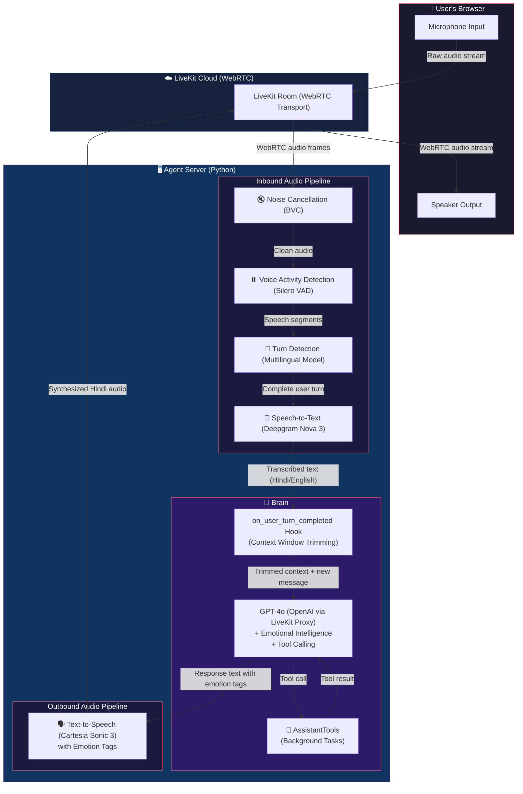

# Voice Agent Architecture

## Audio Pipeline Flow



---

## Detailed Step-by-Step Audio Journey

### Step 1: Microphone → LiveKit Room
The user speaks into their browser microphone. The frontend captures the raw audio using the WebRTC API and streams it to the LiveKit Cloud Room over a low-latency WebRTC connection. No audio processing happens on the client side — all the magic is server-side.

### Step 2: Noise Cancellation (BVC)
The first thing that touches the audio on the server is **LiveKit's BVC (Background Voice Cancellation)**. It strips away:
- Keyboard typing sounds
- Background music
- Fan/AC noise
- Other people talking in the room

This ensures only the user's clean voice reaches the next stages.

### Step 3: Voice Activity Detection (Silero VAD)
The cleaned audio hits the **Silero VAD** model, which detects exactly when the user starts and stops speaking.

| Parameter | Value | What it does |
|-----------|-------|--------------|
| `min_silence_duration` | 0.3s | How long the user must be silent before we consider their turn "done". Lower = faster response, but might cut them off mid-thought. |
| `min_speech_duration` | 0.05s | How little audio counts as "speech". At 50ms, even a quick "hmm" or "uh" is detected, enabling instant barge-in (interrupting the agent). |

### Step 4: Turn Detection (Multilingual Model)
After VAD detects silence, the **Multilingual Turn Detector** decides: "Did the user actually finish their thought, or are they just pausing to breathe?"

This is critical for Hindi/Hinglish because Indian speakers often pause mid-sentence. The multilingual model understands this and waits appropriately instead of cutting the user off.

### Step 5: Speech-to-Text (Deepgram Nova 3)
Once a complete user turn is detected, the audio is **streamed in real-time** to Deepgram's Nova 3 model for transcription.

| Config | Value | Why |
|--------|-------|-----|
| Model | `nova-3` | Latest and most accurate Deepgram model |
| Language | `hi` | Optimized for Hindi, but also handles English and Hinglish naturally |
| Streaming | Yes | Transcription begins as the user speaks, not after they finish |

### Step 6: Context Window Management (`on_user_turn_completed` Hook)
Before the transcript reaches GPT-4o, our custom hook fires. It runs `turn_ctx.truncate(max_items=20)` which:
- Keeps the last **20 messages** in the conversation
- **Always preserves the system prompt** (emotional intelligence instructions)
- Removes old messages to keep the LLM fast and prevent token costs from ballooning
- Cleanly handles partial function call leftovers

This means even a 2-hour conversation stays as fast and cheap as the first minute.

### Step 7: The Brain — GPT-4o with Deep Emotional Intelligence
The trimmed context + new user message is sent to **OpenAI GPT-4o** (routed through LiveKit's AI Proxy to use LiveKit cloud credits).

GPT-4o performs a 3-step internal emotional analysis before every response:

1. **Scan Emotional History (30% weight)** — Reads the last 3-5 user messages to understand the emotional trajectory (are they getting progressively frustrated? recovering from sadness?)
2. **Analyze Current Message (70% weight — HIGHEST PRIORITY)** — Detects emotion from word choice, sentence structure, punctuation patterns, and sarcasm
3. **Blend & Respond** — Combines both signals to select the right emotional tone

#### Emotional Response Rules
| User State | Agent Behavior | Cartesia Tag |
|-----------|----------------|--------------|
| Frustrated | Calm, solution-focused | `<emotion value="calm"/>` |
| Sad | Warm empathy first, then uplifting | `<emotion value="sad"/>` → `<emotion value="calm"/>` |
| Happy | Match their energy | `<emotion value="happy"/>` |
| Sarcastic | Acknowledge frustration underneath | `<emotion value="calm"/>` |
| Angry | De-escalate, never match anger | `<emotion value="calm"/>` |
| Confused | Patient, reassuring | `<emotion value="calm"/>` |

### Step 8: Tool Calling (Async Background Tasks)
If the user asks for something that requires a tool (e.g., "analyze my dataset"), GPT-4o triggers a **function call**. We support two patterns:

#### Fast Tools (1-3 seconds)
The agent says a filler word ("Ek second..."), the tool runs, and the result is spoken immediately.

#### Slow Tools (10+ seconds) — Decoupled Background Pattern
The tool fires off a background task via `asyncio.create_task()` and returns instantly. The agent tells the user "I'm working on it" and continues chatting normally. When the background task finishes, it injects a hidden message via `session.generate_reply()` which forces the agent to wake up and announce the result automatically — the user does NOT need to ask "is it done?".

### Step 9: Text-to-Speech (Cartesia Sonic 3)
GPT-4o's response text (with embedded emotion tags) is streamed to **Cartesia Sonic 3**.

| Config | Value | Why |
|--------|-------|-----|
| Model | `sonic-3-latest` | Ultra-low latency, high-quality voice synthesis |
| Language | `hi` | Native Hindi voice with natural prosody |
| Voice ID | `95d51f79-...` | Custom selected Hindi male voice |
| Sample Rate | 24000 Hz | High-quality audio output |

Cartesia is special because it **natively understands emotion tags**. When GPT-4o outputs:
```
<emotion value="sad"/> अरे यार... <emotion value="happy"/> कोई बात नहीं!
```
Cartesia actually changes the **tone, pitch, and cadence** of the voice to sound sad for the first part and happy for the second part. This is NOT a gimmick — it physically modulates the audio waveform.

### Step 10: Audio → User's Speaker
The synthesized audio is streamed back through the LiveKit Room over WebRTC to the user's browser, where it plays through their speaker in real-time.

---

## Proactive Greeting System

When the user first connects to the room, the agent doesn't wait in silence. The `on_enter()` hook fires immediately and the agent greets the user with a warm Hinglish welcome like:

> *"अरे! कैसे हो यार? बोलो क्या help चाहिए?"*

The greeting is configured separately in `GREETING_INSTRUCTIONS` so you can customize it per use case without touching the main system prompt.

---

## Project Structure

```
Workshop/
├── agent.py              # Core LiveKit agent (entrypoint, session config, hooks)
├── server.py             # FastAPI token server for frontend auth
├── .env                  # API keys (LIVEKIT_URL, LIVEKIT_API_KEY, etc.)
├── requirements.txt      # Python dependencies
├── utils/
│   ├── prompts.py        # SYSTEM_PROMPT + GREETING_INSTRUCTIONS
│   └── tools.py          # AssistantTools (function tools for the LLM)
├── docs/
│   ├── README_ARCHITECTURE.md
│   └── TOOL_CALLING_GUIDE.md
└── frontend/             # React + Vite frontend with waveform visualizer
```

---

## Tech Stack Summary

| Layer | Technology | Role |
|-------|-----------|------|
| Transport | LiveKit Cloud (WebRTC) | Real-time bi-directional audio streaming |
| Noise Cancellation | LiveKit BVC | Removes background noise from user audio |
| Voice Activity Detection | Silero VAD | Detects when the user starts/stops speaking |
| Turn Detection | Multilingual Model | Prevents premature cutoffs in Hindi speech |
| Speech-to-Text | Deepgram Nova 3 | Real-time streaming transcription (Hindi) |
| LLM | OpenAI GPT-4o (via LiveKit Proxy) | Emotional intelligence + tool calling |
| Text-to-Speech | Cartesia Sonic 3 | Expressive Hindi voice with emotion modulation |
| Frontend | React + Vite | Waveform visualizer + connection UI |
| Token Server | FastAPI (Uvicorn) | Generates LiveKit access tokens |
