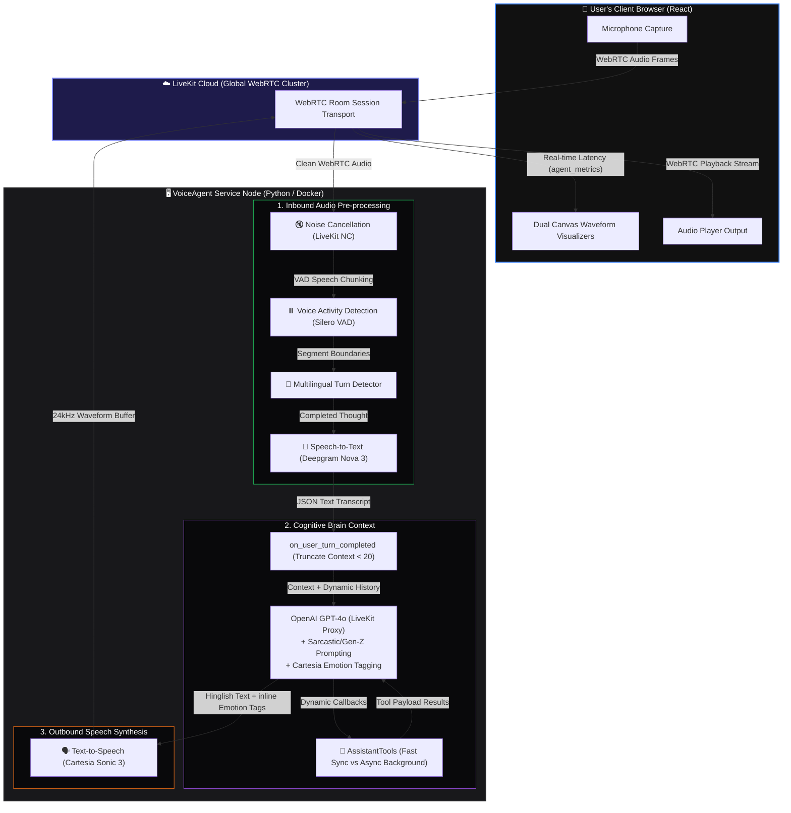

# Voice Agent Enterprise Architecture & Pipeline System

This documentation describes the high-throughput, low-latency conversational audio system built for **VoiceAgent**. It is designed to run on scalable container clusters, handling WebRTC transport, real-time speech analytics, cognitive Large Language Model processing, and expressive voice synthesis.

---

## 🏛️ System Architecture Overview

The voice agent is built on a decoupled pipeline that splits work between low-level media transport (WebRTC), local classification models (VAD, Noise Cancellation), and cloud-hosted inference engines (Speech-to-Text, LLM Brain, Text-to-Speech).



---

## 🔄 End-to-End Audio Journey Lifecycle

### 1. Inbound Audio Transport (Microphone → LiveKit Cloud)
The client browser requests a signed JWT access token from the backend FastAPI `/getToken` endpoint. Using this token, the React frontend mounts a `<LiveKitRoom>` and connects to LiveKit Cloud. WebRTC transport guarantees sub-100ms bi-directional audio delivery.

### 2. Deep Noise Cancellation & Preprocessing
The incoming raw audio stream undergoes server-side preprocessing utilizing **LiveKit's Background Voice Cancellation (NC)**. This filter dynamically isolates vocal ranges, stripping away:
- Environmental background hums (AC, fans).
- Transient audio clicks (keyboard typing, background chatter).

### 3. High-Frequency Voice Activity Detection (VAD)
The cleaned vocal stream is evaluated locally by the **Silero VAD** neural model. VAD classifies incoming raw PCM audio arrays on a millisecond scale:
* **Activation Threshold (0.35)**: The confidence cutoff above which audio is marked as human speech. Allows near-instant response detection.
* **Min Speech Duration (0.05s)**: Human speech must persist for at least 50 milliseconds to activate, enabling rapid barge-in capabilities while ignoring quick background coughs.
* **Min Silence Duration (0.3s)**: Tells the agent to wait 300ms after the user finishes speaking before initiating turn-completion logic.

### 4. Multilingual Turn Detection (Smart-Pause Protection)
When VAD detects a silence boundary, a multilingual turn detector determines whether the user has finished their sentence or is simply pausing to breathe. This prevents the agent from rudely interrupting users mid-thought, which is extremely common in mixed Hinglish conversations.

### 5. Speech-to-Text Transcription (Deepgram Nova-3)
The resolved audio segment is streamed to **Deepgram's Nova-3** speech engine:
- Configured for the **Hindi (`hi`)** locale.
- Highly optimized for phonetic Hinglish, transcription begins in a streaming fashion as the user speaks.

### 6. Cognitive Truncation & Memory Hook
Before the transcription is passed to the LLM, the `on_user_turn_completed` hook is triggered:
- The conversation history is evaluated and truncated to a maximum of **20 context items** via `turn_ctx.truncate(max_items=20)`.
- The system prompt instructions and personality boundaries are always locked and preserved.
- Older turns are dropped to keep the LLM response time consistent and prevent cost inflation.

### 7. Core Brain Processing (GPT-4o with Emotional Intelligence)
The trimmed context array is processed by **OpenAI GPT-4o**. GPT-4o analyzes:
1. **Historical Context (30% weight)**: The progression of user emotions across the last 3-5 statements.
2. **Immediate Message (70% weight)**: Word choice, punctuation, sarcasm, and urgency.
GPT-4o then blends this assessment, dynamically matching the user's emotional state by embedding inline XML tags inside the Hinglish output:
```html
<emotion value="sad"/> अरे यार... <emotion value="happy"/> कोई बात नहीं, मैं हूँ ना!
```

### 8. Speech Synthesis (Cartesia Sonic 3)
The marked-up Hinglish text is streamed to the **Cartesia Sonic 3** TTS system:
- **Sonic-3-latest** model guarantees sub-150ms Time-To-First-Byte (TTFB).
- **Hindi Male Custom Voice ID (`95d51f79-...`)** delivers natural accentuation and Hinglish cadence.
- Cartesia reads the XML emotion tags inline, dynamically modulating the **pitch, speed, and timbre** of the voice to actually sound "happy", "calm", "sad", "surprised", or "angry" in real time.

### 9. Outbound Audio & UI Latency Tracker
The generated audio stream is pushed back through the LiveKit room over WebRTC to the user's speaker. Simultaneously, the agent's metric collector measures execution delays across the three pipeline layers:
1. **STT Transcription Delay**: Time from user silence to transcript delivery.
2. **LLM Brain TTFT**: Time from transcript to first token generated by GPT-4o.
3. **TTS Synthesis TTFB**: Time from LLM token to first audio byte created by Cartesia.

These measurements are bundled into a JSON payload and broadcasted over a custom WebRTC data channel topic (`agent_metrics`), populating real-time latency charts directly in the client dashboard.
